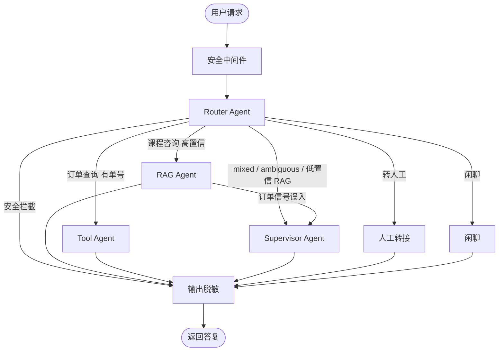

# 智能客服系统

课程咨询走 RAG，订单查询走订单 API。请求先经过安全中间件，再由 Router 分流到专门节点或 Supervisor。分流规则统一在 `RoutingPolicy`：明确意图直达；低置信、订单信号误入 RAG、以及 `mixed` / `ambiguous` 交给 Supervisor。




Router 规则优先：明确课程/订单/转人工直达；`mixed`（多意图确定）与 `ambiguous`（缺单号、过短问句、问候混业务词）交给 Supervisor。Supervisor 先做计划再执行：能绑上单号/课名则直接调订单与课程能力（无依赖可并行，课名依赖订单商品则先查单再检索）；需要澄清则 `ask_user` 不调工具；绑不上或依赖不明才走 ReACT 兜底。已进入 RAG 但本轮问句含订单信号时，不生成课程答案，直接升 Supervisor，不重跑 Router。

编译图后会导出 Mermaid：`python main.py graph`，浏览器打开 [http://127.0.0.1:8000/graph](http://127.0.0.1:8000/graph) 。

## 核心场景


| 场景     | 示例                          | 流程                                              |
| ------ | --------------------------- | ----------------------------------------------- |
| 课程咨询   | Python入门课包含哪些内容？            | 高置信直达 RAG：检索大纲 → 结构化输出模块 + 学习路径                 |
| 订单查询   | 查询订单#20251114001的退款进度       | 有单号直达 Tool：订单 API → 进度可视化报告                     |
| 混合（串行） | 订单#20251114001 这门课讲什么，退款进度呢 | Supervisor：课名不在问句里，先查单拿 `product_name` 再检索      |
| 混合（并行） | 订单20251114001买的入门课包含哪些内容？   | Supervisor：单号与课名都能绑定，查单与检索同组并发                  |
| 缺单号澄清  | 查一下我的订单 / 退款进度怎么样           | 降为 `ambiguous`，Supervisor `ask_user` 要完整单号，不调工具 |
| 跨轮追问   | （已查过单）那退款呢 / 进度怎么样          | 槽位回填 `last_order_no`，仍走订单 Tool，不必重说单号           |
| 绑不上兜底  | 那个怎么样了                      | Supervisor 无法绑定单号/课名，走 ReACT 多轮 Think-Act       |
| 转人工    | 转人工 / 我要找人工客服               | 直达 handoff，演示环境返回转接确认                           |
| 闲聊     | 你好 / 今天天气怎么样                | 直达 chitchat，说明课程咨询与查单能力                         |


## 技术栈


| 模块    | 选型                         | 说明                                     |
| ----- | -------------------------- | -------------------------------------- |
| 核心框架  | LangChain ≥ 1.0            | `create_agent` + LangGraph             |
| 向量库   | FAISS 1.8.0 + 应用层 BM25/RRF | 课程大纲检索（专名走分词）                          |
| 大模型   | DeepSeek API               | `langchain-deepseek` / `deepseek-chat` |
| 数据存储  | MySQL 8.0+ / SQLite + OSS  | 订单与报告归档                                |
| 安全中间件 | Callback + AgentMiddleware | 适配 LangChain v1.0                      |


未配置 `DEEPSEEK_API_KEY` 时仍可本地演示：路由走关键词，课程咨询走检索模板，订单查询走数据库。Key 已配但上游持续失败时，网关按连续失败打开熔断（不再逐请求重试），回复链路降到同一套离线能力，`respond` 兜底模板话术。

## 快速开始

```bash
cd CustomerService
python -m venv .venv
source .venv/bin/activate
pip install -e ".[dev]"
cp .env.example .env
# 可选：写入 DEEPSEEK_API_KEY

# Docker：启动 MySQL 8 与 Redis（docker-compose.yml）
docker compose up -d
# 仅 Redis（多进程 / 重启后续聊）：docker compose up -d redis
# 使用 Docker 依赖时在 .env 中设置：
# DATABASE_URL=mysql+pymysql://cs:cs@127.0.0.1:3306/customer_service?charset=utf8mb4
# REDIS_URL=redis://127.0.0.1:6379/0
# 查看状态：docker compose ps
# 停止：docker compose down

# 首次或更换 embedding 后重建向量索引；日常用增量 ingest（先写新 chunk 再软删旧切片）
python main.py ingest
# 全量重建：python main.py ingest --rebuild

python main.py seed
python main.py chat "Python入门课包含哪些内容？"
python main.py chat "查询订单#20251114001的退款进度"
# serve / chat 只加载已有索引，不会在启动时 ingest；缺索引会直接退出
python main.py serve
# 或：python -m app.app
# 流程图：python main.py graph  或打开 http://127.0.0.1:8000/graph
```

浏览器打开 [http://127.0.0.1:8000](http://127.0.0.1:8000) 。HTTP 接口示例见下方「接口测试」。

## 配置

复制 `.env.example` 为 `.env`。未列出的项有默认值，完整清单见 `.env.example`。

| 变量 | 说明 |
| --- | --- |
| `DEEPSEEK_API_KEY` | DeepSeek 密钥；不配则走离线路由与检索模板 |
| `DATABASE_URL` | 默认 SQLite；生产用 `mysql+pymysql://cs:cs@127.0.0.1:3306/customer_service?charset=utf8mb4` |
| `REDIS_URL` | 会话、档案、配额与并发槽。单进程演示可留空；多 worker / 生产必须配置。填了但 ping 失败会拒绝启动 |
| OSS 四项 | `OSS_ACCESS_KEY_ID` / `SECRET` / `BUCKET` / `ENDPOINT` 配齐后上传阿里云，否则写 `data/oss/` |
| `EMBEDDING_BACKEND` | 默认 `huggingface`（`BAAI/bge-small-zh-v1.5`）。离线可改 `ngram`。换模型或维度后必须 `python main.py ingest` |

MySQL 8 与 Redis：`docker compose up -d`（账号 `cs` / `cs`，库名 `customer_service`）。

### Langfuse（可选）

```bash
cp langfuse.env.example langfuse.env
docker compose -f docker-compose.langfuse.yml -p cs-langfuse --env-file langfuse.env up -d
```

UI [http://127.0.0.1:3000](http://127.0.0.1:3000)。把 `LANGFUSE_PUBLIC_KEY` / `LANGFUSE_SECRET_KEY` / `LANGFUSE_HOST` 写入应用 `.env`。未配置时服务照常运行。

## 多租户

行级隔离：共享一个库；课程知识按租户 FAISS 子索引检索。登录用户查单再按下单人校验。

- HTTP Header：`X-Tenant-Id`（缺省 `demo`）、`X-User-Id`（缺省 `anonymous`；`POST /chat` 中 Header 优先于 JSON `user_id`）
- CLI：`python main.py --tenant demo chat "..." --user u10001`
- 订单 `20251114001` 属于 `demo` / `u10001`；`acme` 或登录用户 `alice` 查询应 404
- 匿名可凭本轮单号查询（演示）；登录用户只能查 `Order.user_id` 匹配的订单，禁止用他人记忆回填
- 知识库：`data/knowledge/*.md` → `demo`；`data/knowledge/<tenant>/*.md` → 对应租户
- OSS 对象路径：`{prefix}/{tenant_id}/reports/...`

若本地已有旧 SQLite，需删除 `data/customer_service.db` 后重新 `python main.py seed`。更换 embedding 或维度后必须 `python main.py ingest` 重建 FAISS。

## 目录

```
app/
  security/     安全过滤、LangChain Callback、v1.0 AgentMiddleware
  agents/       意图识别 / Policy 分流 / Router / RAG / Tool / Supervisor（计划+执行）/ ReACT 兜底
  rag/          课程知识切片、FAISS；检索为向量 + jieba BM25 + RRF；ingest 增量 + 软删除
  capabilities/ 业务能力总线（订单/课程）；Graph、Supervisor、ReACT 共用
  services/     订单等领域服务（查库、报告、OSS 归档）
  tools/        ReACT 挂载的 LangChain Tool 薄入口（实现在 capabilities）
  db/           SQLAlchemy 模型与示例数据；会话/用户档案冷归档
  oss/          阿里云 OSS / 本地回退
  tenancy.py    多租户 Header / 上下文
  llm_gateway/  LLM 超时/重试/记账/租户日限额/短缓存
  runtime.py    进程装配层（AppContext：图 / checkpointer / Redis / Store / Gateway）
  tool_cache.py  工具成功结果缓存（会话 structured + Redis TTL）
  tool_escalation.py  瞬态失败计数与自动转人工
  config/       运行配置 mixin（llm / rag / capacity / memory / telemetry / resilience）
  observability/ request_id、JSON 日志、Prometheus（metrics/names|store|instruments）、OTel→Langfuse、就绪检查
  graph/        LangGraph 主流程（state 按 identity/route/memory/result 分组 / nodes / builder）
  context/      会话窗口、滚动摘要、跨轮槽位
  app.py        FastAPI 入口（POST /chat SSE）
data/knowledge/ 课程大纲 Markdown（根目录=demo，子目录=租户）
evals/          路由 / RAG / 忠实度 / 订单 / ReACT / 安全黄金评测集（JSONL）
docker-compose.yml           本地 MySQL 8 + Redis
docker-compose.langfuse.yml  自建 Langfuse（项目名 cs-langfuse，仅暴露 3000）
```


## API

- `GET /health` 进程探活（liveness）
- `GET /ready` 就绪检查（数据库、已配置时的 Redis、FAISS 索引）；失败返回 503；**不含** Langfuse
- `GET /metrics` Prometheus 文本指标（多 worker 时合并所有存活进程；QPS / 整轮耗时 / 节点耗时（含 chitchat / handoff）/ 首 token TTFT / 每轮 LLM 次数 / ReACT 撞限 / 查单与课程检索 `cs_tool_calls_total{tool=order_query|course_retrieve,outcome=...}` / 工具瞬态失败缓存回退 `cs_tool_cache_hit_total{tool,source}` / 自动转人工 `cs_tool_escalation_total{reason}` / 工具池水位 `cs_tool_pool_in_flight{pool=order|course}` / 跑飞 `cs_agent_runaway_total` / 用户赞踩 `cs_user_feedback_total{value=up|down}` / `cs_llm_tokens_total{direction=prompt|completion}` / `cs_llm_cost_yuan_total{tenant,tag}` / 配额 / 空召回等；`cs_http_duration_seconds` 对 SSE 仍是到首包，不是 TTFT）
- `GET /graph` LangGraph 可视化流程图
- `GET /greet` 开场白（问候与预置选项）
- `POST /chat` 智能客服对话（SSE：`meta` / `status` / `token` / `answer` / `done`；`meta`/`done` 带 `request_id` / `trace_id` 供赞踩；RAG / ReACT 会推 `token` 增量；`done.usage` 为本轮 LLM 分步合计；JSON 字段为 `message`；可选 `session_id` 续聊；Header `X-Tenant-Id` / `X-User-Id` / `X-Request-Id` / `traceparent`）
- `POST /feedback` 用户赞踩（`trace_id` / `value` 0|1；可选 `request_id` / `session_id` / `comment`）→ Prometheus + Langfuse `user_feedback`
- `POST /api/v1/chat` 兼容旧路径，仍返回一整段 JSON
- `GET /api/v1/orders/{order_no}` 订单进度 API（按租户与下单人隔离）

可观测分工：`/metrics` + JSON 日志负责容量与告警（JSON 带 `request_id` / `trace_id` / `span_id`）；配置 Langfuse 后：自动 score（`blocked` / `handoff` / `rag_empty` / `turn_ok`）+ 用户赞踩 `user_feedback`；Prompt Management 名称 `cs.intent` / `cs.react` / `cs.rag_markdown` / `cs.rag_structured` / `cs.summary`（未创建则用代码内 fallback，改文案不必发版）；OpenTelemetry 打 HTTP 根 span、LangGraph 节点子 span、FAISS 检索 span，以及 DB/Redis/出站 HTTP，OTLP 进同一 Langfuse。演示页 `/` 每条回复可点「有用 / 无用」。

告警规则在 [`deploy/prometheus/`](deploy/prometheus/)：用现有 Prometheus 加载 `rule_files: rules/cs.yml`（样例见 `prometheus.yml`），Alertmanager 最小样例见 `alertmanager.yml`。本仓库不提供 Grafana。规则对应：

- `CsOrderQuerySuccessRatioLow`：查单成功率 `ok/(ok+not_found+deny+timeout+error)` 骤降（recording：`cs:order_query:success_ratio`；`busy` 不进分母）
- `CsOrderQueryTimeoutSpike`：`cs_tool_calls_total{tool=order_query,outcome=timeout}` 占比突增
- `CsAgentRunawaySustained` / `CsReactLimitHitSustained`：`cs_agent_runaway_total` / `cs_react_limit_hit_total` 持续非零
- `CsToolEscalationSustained`（可选）：`cs_tool_escalation_total` 持续非零，提示工具层自动转人工增多
- `CsLlmCallsPerTurnP95High`：`cs_llm_calls_per_turn` p95 与 `AGENT_RUNAWAY_LLM_CALLS`（默认 8）对齐

同一 `tenant_id` + `user_id` + `session_id` 会累加对话历史与会话槽位（短期记忆），追问可引用上文；未传 `session_id` 则每次生成新会话。不同用户即使复用同一 `session_id` 也不会串话。历史按 token 预算裁剪（默认约 8000 token，至少保留最近 10 条）；裁掉的旧轮次会压成 `session_summary` 随 checkpoint 一起保存（默认 LLM 摘要，失败回退规则）。未配 `REDIS_URL` 且单进程时用内存（重启后续不上聊）。配置后 checkpoint、用户档案、会话锁和 LLM 配额都走 Redis（热缓存）；**会话窗口消息 / 槽位 /** `session_summary` **与登录用户档案同时归档到** `DATABASE_URL`**（**`session_archives` **/** `user_profiles`**）**，Redis TTL 淘汰或误删后 miss 会从库回填并写回热缓存。已配置 Redis 但连不上会拒绝启动，不会静默回退。多 worker 必须配 Redis。传入稳定的 `user_id`（非 `anonymous`）时，订单号、最近课程等结构化事实会写入 Store，**换 session 也能回填**。LLM 日配额仍只在 Redis / 进程内存，不进库。

## 测试

默认走离线路径：测试会话会改用 ngram 索引，并清空 `DEEPSEEK_API_KEY`，不依赖本机 `.env` 里的密钥。请用项目虚拟环境里的解释器，避免系统 `PATH` 里没有 `pytest`。

```bash
# 安装开发依赖（含 pytest / ruff / pytest-cov）
pip install -e ".[dev]"

# 本地 / CI 必跑（离线，不调真实 LLM）
.venv/bin/pytest -q
.venv/bin/ruff check app tests

# 黄金集（keyword / 规则；不含真实 Langfuse）
.venv/bin/pytest -q tests/test_eval_routing.py tests/test_eval_rag.py \
  tests/test_eval_faithfulness.py tests/test_eval_order.py \
  tests/test_eval_react.py tests/test_eval_security.py

# 可选覆盖率
.venv/bin/pytest -q --cov=app --cov-report=term-missing

# 可选 RAGAS nightly（需 pip install -e ".[dev,eval]" 与 DEEPSEEK_API_KEY）
RUN_LLM_EVAL=1 .venv/bin/pytest -q -m llm tests/test_eval_ragas.py

# nightly：真实 LLM 路由 / ReACT 工具轨迹（需要 DEEPSEEK_API_KEY）
RUN_LLM_EVAL=1 .venv/bin/pytest -q -m llm
# 或：python main.py eval
#      python main.py eval --llm
#      python main.py eval harvest          # 失败样本导出到 evals/pending/
#      python main.py eval merge-pending    # 预览合并；加 --apply 写入正式 evals
```

