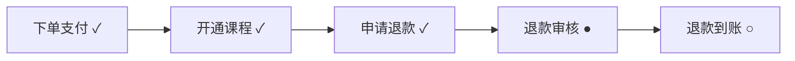

**订单 20251114001 · Python入门课**
当前状态：退款审核中　进度：███████░░░ 70%

| 节点 | 状态 | 时间 | 说明 |
|---|---|---|---|
| 下单支付 | 已完成 | 2025-11-14 10:21 | 微信支付成功 |
| 开通课程 | 已完成 | 2025-11-14 10:22 | 已开通 Python入门课 学习权限 |
| 申请退款 | 已完成 | 2025-11-20 19:08 | 用户提交退款申请，原因：时间冲突 |
| 退款审核 | 进行中 | 2025-11-21 09:30 | 财务审核中，预计 1-3 个工作日 |
| 退款到账 | 待处理 | - | 审核通过后原路退回 |